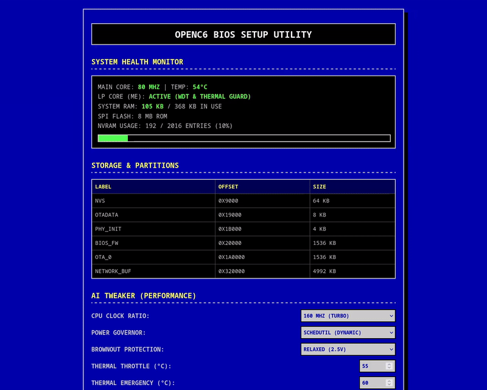
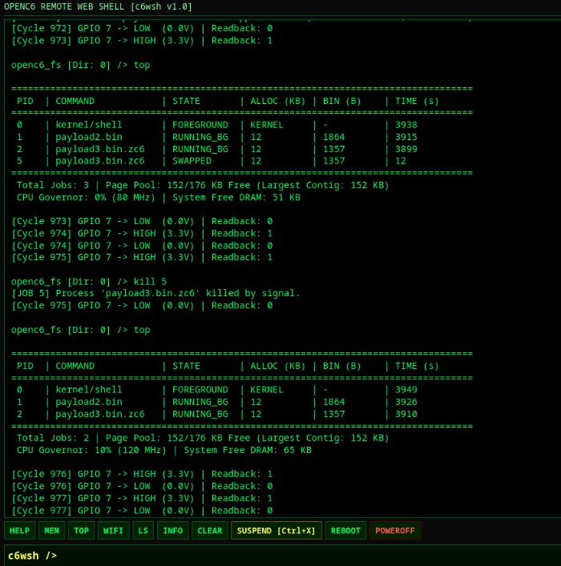
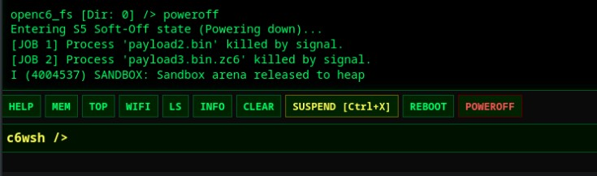
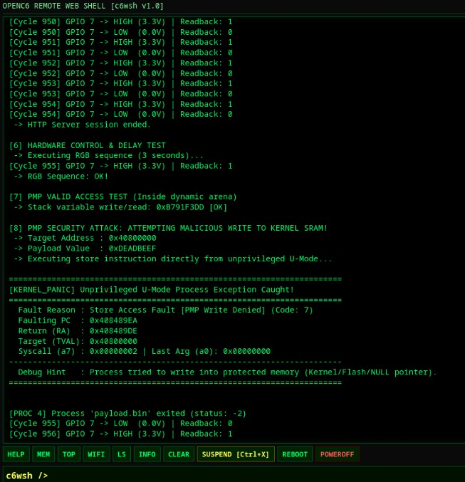
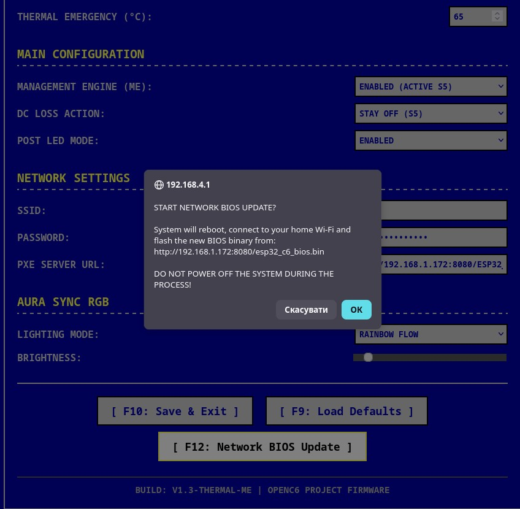
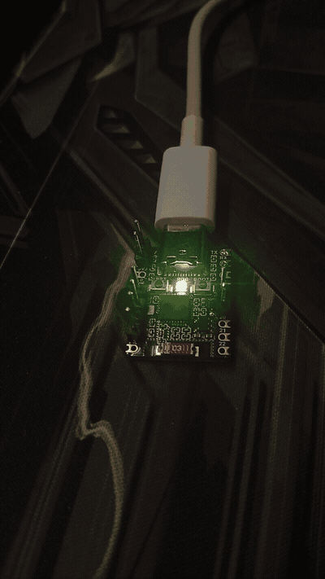
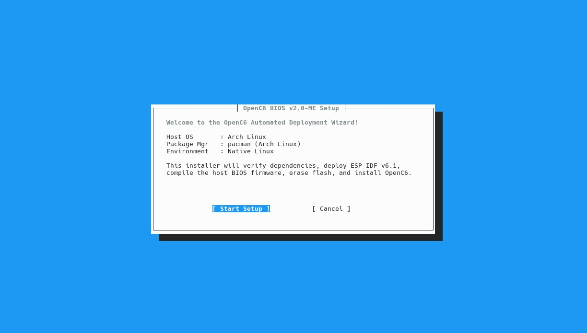
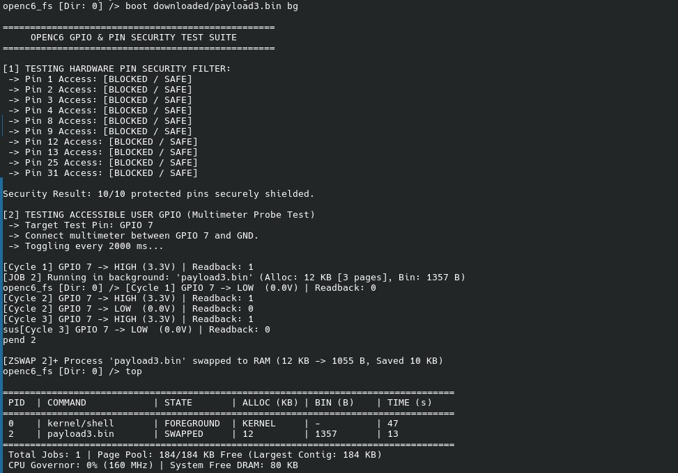
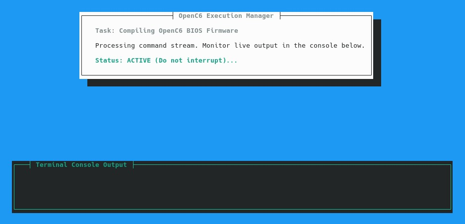

# OpenC6 BIOS: Advanced Modular Firmware and Microkernel for ESP32-C6

[](https://opensource.org/licenses/MIT)
[](https://www.espressif.com/en/products/socs/esp32-c6)
[](https://riscv.org/)
[](https://send.monobank.ua/jar/9UcKZ4zVnu)

<p align="center">
  <a href="https://trendshift.io/repositories/54987?utm_source=trendshift-badge&utm_medium=badge&utm_campaign=badge-trendshift-54987" target="_blank" rel="noopener noreferrer">
    
  </a>
</p>

OpenC6 is an open-source, high-performance BIOS and microkernel architecture designed for the ESP32-C6 (RV32IMAC). It decouples platform-level hardware initialization from user-space execution, bringing PC/Workstation architecture paradigms to microcontrollers.

Instead of deploying monolithic firmwares, OpenC6 acts as an operating host. It manages bare-metal silicon resources, runs an autonomous out-of-band supervisor on the LP-Core coprocessor, enforces hardware memory protection via Physical Memory Protection (PMP), and exposes a standardized System Call ABI. This allows dynamic loading, multitasking execution, and network deployment of unprivileged User-Mode (U-Mode) payloads without recompiling the host operating system.

---

## Visual Demonstration

### 1. Retro BIOS Web Setup Utility
Classic 5:4 blue-screen configuration utility hosted directly on ESP32-C6 via standalone AP mode (192.168.4.1).


### 2. Preemptive Multitasking & Telemetry (top)
Local Micro UNIX Shell monitoring active process states, dynamic 4 KB page allocation, CPU load, and governor state.


### 3. Remote Web Shell (c6wsh)
Lightweight streaming terminal interface running on port 80 over local Wi-Fi.


### 4. Hardware PMP Isolation & Trap Interception
Real-time register dump and fault diagnosis when an untrusted U-Mode binary attempts illegal memory access.


### 5. Wireless BIOS Firmware Update (OTA)
Safe host firmware flashing over Wi-Fi backed by hardware A/B partition rollback logic.


### 6. Dynamic Aura Sync & POST Diagnostics
Single-cycle atomic WS2812 driver scaling pulse timings to match active CPU frequency (80/120/160 MHz).


### 7. Automated C99 TUI Installer
Freestanding zero-dependency terminal setup wizard automating host prerequisites and ESP-IDF v6.1 deployment.


### 8. ZSWAP In-Memory Page Compression
Suspended background process memory pages compressed in RAM via the custom ZC6 v4 engine (12 KB process compressed down to 1055 B, releasing 10 KB of physical arena pages back to the pool).


---

## Key Architectural Systems

### 1. Hardware PMP Isolation (U-Mode Sandbox)
User applications execute strictly in unprivileged RISC-V User Mode (`U-Mode`). Top-of-Range (`TOR`) Physical Memory Protection registers isolate the execution arena from the host:
* Kernel DRAM, host execution stacks, and internal subsystem memory are strictly unreadable and unexecutable to payloads.
* Direct access to MMIO peripheral registers (`0x60000000+`) is hardware-blocked (Default Deny).
* Safe syscall dispatch via machine-level `ecall` with atomic stack switching via `mscratch`.
* Custom interrupt vector trampoline (`sandbox_intr_trampoline`) resolves FreeRTOS context-switch privilege leakage bugs on RISC-V.
* **Role of FreeRTOS:** FreeRTOS is retained strictly as an underlying thread scheduler and transport layer required by Espressif's proprietary Wi-Fi baseband blobs (`libnet80211`). OpenC6 bypasses FreeRTOS primitives for process isolation, memory allocation, virtual filesystems, and trap handling, operating as a true microkernel supervisor over bare-metal RISC-V hardware.

### 2. Autonomous Management Engine (LP-Core ME)
An out-of-band supervisor running independently on the Low-Power (ULP) RISC-V coprocessor:
* Hardware Watchdog monitoring main core execution (15-second hardware timeout).
* Junction temperature tracking via on-die TSENS: thermal throttling down to 80 MHz at 55 deg C, emergency hardware soft-off (`LP_WDT`) at 75 deg C.
* Power button handling with leaky-bucket debouncing (3-second hold triggers hardware force reset).

### 3. Hardware SchedUtil Frequency Governor
Autonomous CPU frequency scaling running on the LP-Core:
* Measures run-time load via a zero-overhead FreeRTOS SysTick hook operating strictly out of internal DRAM (immune to Flash cache disable stalls).
* Directly switches HP CPU frequency dividers across 80, 120, and 160 MHz using hardware PCR registers (`0x60096118`).
* Asymmetric hysteresis: instant step-up upon load spikes, 1000 ms hold prior to downscaling.

### 4. Process Manager & ZSWAP Engine
Preemptive job control supporting up to 8 concurrent processes:
* Dynamic memory allocator managing a pool of contiguous 4 KB pages using Next-Fit arbitration.
* Full shell job control: background execution (`boot <path> bg`), foreground management (`fg`, `bg`), process suspension, and termination (`kill`).
* **ZSWAP Architecture:** Suspended processes (`Ctrl+X`) have their memory pages compressed into RAM via the custom **ZC6** algorithm (~1.2 KB match-finder footprint), releasing physical 4 KB pages back to the arena.
* **Transparent Execution:** Binaries compressed as `.zc6` archives on flash are decompressed into RAM on the fly prior to launch.

### 5. Log-Structured Circular Flash VFS (openc6_fs)
High-performance circular filesystem residing in a dedicated SPI Flash partition:
* Fast RAM-backed directory index (`RamNode`) with dynamic chunk-based caching.
* Automatic background garbage collection (`gc_step`) with sector-erase watchdog yielding.
* Native directory hierarchy supporting standard POSIX operations (`ls`, `cd`, `mkdir`, `cat`, `write`, `cp`, `mv`, `rm`).

### 6. Dual Management Console
* **Local Terminal:** Micro UNIX Shell hosted over native USB-Serial-JTAG CDC (immunity against host DTR/RTS auto-reset drops).
* **Remote Web Shell (`c6wsh`):** Non-blocking HTTP console on port 80 with chunked output streaming and input queue multiplexing.

---

## Hardware Pinout (ESP32-C6-Zero / Generic C6)

| Pin | Identifier | Hardware Function | Description |
|---|---|---|---|
| **GPIO 3** | `PIN_BTN_GND` | Output (0V) | Virtual ground latch for power button |
| **GPIO 4** | `PIN_BTN_SENSE` | Input (Pull-Up) | Power sense line (Wakeup / 3s Reset / Setup trigger) |
| **GPIO 8** | `WS2812_GPIO` | Output | Addressable RGB POST diagnostics & Aura Sync LED |
| **GPIO 9** | `PIN_BTN_BOOT` | Input (Pull-Up) | Physical BOOT button; hold during power-on for Boot Menu |
| **GPIO 1, 2** | `CLEAR_NVRAM` | Input / Ground | Hardware Clear CMOS jumper (Short during boot to reset) |
| **Type-C** | Native USB | D- / D+ PHY | Direct USB CDC console, binary loader, and JTAG |

---

## Micro UNIX Shell Command Reference

Connect to the USB Type-C interface using any serial monitor (115200 baud, 8N1):

### System & Diagnostics
* `help` - Display available shell commands.
* `info` - View hardware CPU frequency, governor load, tick counts, temperature, and ME state.
* `mem` - Display dynamic arena capacity and internal DRAM allocation.
* `top` - Display process table, CPU governor metrics, and page pool status.
* `reboot` - Warm restart of the processor.
* `poweroff` / `exit` - Terminate running processes and enter S5 Soft-Off state.

### Process & Job Control
* `boot <path> [bg]` - Execute binary in foreground or background (`bg` or `&`).
* `fg <pid>` - Bring background or suspended process to foreground.
* `bg <pid>` - Resume suspended process in background.
* `suspend [pid]` - Suspend running process and compress memory via ZSWAP (`Ctrl+X` in console).
* `kill <pid>` - Terminate process and cleanly release socket descriptors.

### Binary Transfer & Networking
* `serial [path]` - Receive binary over USB CDC via `openc6_loader` (Default: `/downloaded/payload.bin`).
* `pxe <url>` - Download payload over Wi-Fi directly into Flash storage.
* `wifi scan` - Scan 2.4 GHz spectrum (Channels 1-13) and print RSSI table.
* `wifi connect <ssid> [pass]` - Associate with AP and commit credentials to NVRAM.
* `wifi status` - Print MAC address, L3 IPv4 address, and link parameters.
* `wifi disconnect` - Disconnect station interface.

### File System Operations
* `ls [path]` - List directory contents.
* `cd <path>` - Change active directory.
* `mkdir <path>` - Create directory node.
* `cat <path>` - Print file contents.
* `write <path> <text>` - Write text stream to file.
* `cp <src> <dst>` - Duplicate file.
* `mv <src> <dst>` - Move or rename file.
* `rm <path>` - Delete file or empty directory node.
* `format` - Erase filesystem partition and initialize blank ring structure.

---

## Quick Start Guide

### 1. Automated Installation (Recommended)
OpenC6 features a standalone C99 TUI deployment wizard that automatically configures host prerequisites, installs the ESP-IDF v6.1 RISC-V toolchain, compiles the BIOS, wipes stale flash partitions, and programs the target hardware.



Ensure `make` is installed on your host system:
```bash
# Arch Linux / Manjaro
sudo pacman -S make

# Ubuntu / Debian
sudo apt update && sudo apt install -y make
```

Clone the repository and launch the automated setup wizard:
```bash
git clone https://github.com/Rompass/openc6-bios.git
cd openc6-bios
make setup
```

### 2. Manual Build and Flash (Advanced)
If you already have ESP-IDF v6.1+ configured and sourced in your active shell:
```bash
. $IDF_PATH/export.sh
idf.py build erase-flash flash monitor -p /dev/ttyACM0
```

### 3. Build Host Utilities and Target Payloads
The `tools/` directory includes an automated build system that compiles host utilities (`openc6_loader`, `zc6_pack`) alongside bare-metal RISC-V payloads in `tools/example/*.c`:

```bash
cd tools

# Builds host tools and cross-compiles all example/*.c payloads
make
```

Build outputs are placed in `tools/build/bin/`:
* `tools/build/bin/openc6_loader` — Host deployment utility.
* `tools/build/bin/zc6_pack` — ZC6 payload compression tool.
* `tools/build/bin/payloads/*.bin` — Compiled flat RISC-V binary payloads.

### 4. Deploy and Run Payloads via Serial (Type-C)
To stream and execute a compiled payload over the native USB CDC interface:

```bash
# 1. In the OpenC6 interactive shell, arm the receiver:
openc6_fs [Dir: 0] /> serial

# 2. On your host machine, stream the generated binary:
./tools/build/bin/openc6_loader /dev/ttyACM0 tools/build/bin/payloads/payload.bin

# 3. Launch the deployed binary in the U-Mode Sandbox:
openc6_fs [Dir: 0] /> boot /downloaded/payload.bin
```

To run the payload as a preemptive background job:
```bash
openc6_fs [Dir: 0] /> boot /downloaded/payload.bin bg
```

---

## Network Booting (PXE) and BIOS Updates

OpenC6 supports network payload loading and full host updates over Wi-Fi:

### Method A: Network Booting a Payload (PXE)
1. Host compiled payload on your workstation:
   ```bash
   python3 -m http.server 8080
   ```
2. In the OpenC6 shell, fetch the payload:
   ```text
   openc6_fs [Dir: 0] /> pxe http://<HOST_IP>:8080/payload.bin
   ```
3. Launch the downloaded image:
   ```text
   openc6_fs [Dir: 0] /> boot /downloaded/payload.bin
   ```

### Method B: Wireless BIOS Firmware Update (OTA)
1. Build the updated BIOS (`idf.py build`) and serve `openc6_bios.bin` over HTTP.
2. Enter the BIOS Setup Web UI (Hold power button for 3s during power-on or boot menu, connect to `BIOS_SETUP_C6`, open `http://192.168.4.1`).
3. Set the PXE Server URL to your firmware binary endpoint.
4. Click **[ F12: Network BIOS Update ]**.
5. The system downloads the binary into the passive OTA slot, verifies partition integrity, marks the boot slot, and restarts. In case of boot failure, hardware watchdog initiates automatic rollback.

---

## Payload Development

For complete architectural specifications, memory maps, system call tables, C runtime examples, and compiler flags:

Refer to **[Payload Development & ABI Reference](docs/payload_development.md)**.

---

## Project Roadmap

* **Unified Hardware Abstraction Layer (HAL):** Decoupling architecture-specific drivers (PMP, LP-Core coprocessor, PCR registers, USB CDC) into a modular HAL interface to enable flexible porting across other RISC-V platforms and targets.

---

## License

This project is licensed under the MIT License. See `LICENSE` for details.

---

## Stand with Ukraine
This project was developed in Ukraine. Consider supporting verified charities such as [Come Back Alive](https://savelife.in.ua/en/) to aid the defense against Russian aggression.
